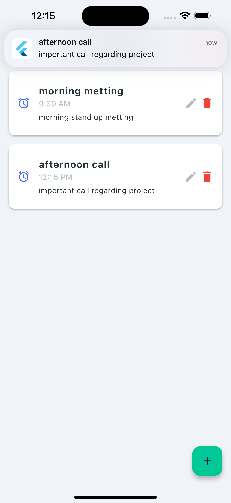

# 🕑 Daily Reminder

A simple Flutter app to manage your daily reminders. This app lets you add, edit, and delete reminder tasks — all stored locally using SQLite. It’s lightweight, fast, and works completely offline.

---

## ✨ Features

- 📋 View a list of all your reminders  
- ➕ Add new reminders with title, description, and time  
- ✏️ Edit existing reminders  
- 🗑️ Delete reminders  
- 💾 Data stored locally using SQLite  
- 🎨 Clean and minimal UI  
- 🔔 Receive notifications for your reminders  

---

## 📚 What I Learned

This project helped me learn and apply the following:

- How to use **SQLite** in a Flutter app using the `sqflite` plugin  
- Creating and managing **local databases**  
- Performing **CRUD operations** (Create, Read, Update, Delete)  
- Navigating between screens using **Navigator**  
- Managing state with `setState()` in **StatefulWidget**  
- Building a clean and user-friendly UI with **Material Design**  
- Setting up and handling **local notifications** in Flutter

---

## 🔧 Technologies Used

- **Flutter** – UI framework for building cross-platform apps  
- **Dart** – Programming language used with Flutter  
- **SQLite** – Local database for persistent storage  
- **sqflite** – SQLite plugin for Flutter  
- **path** – To manage file paths for database  
- **flutter_local_notifications** – Plugin for handling local notifications

---

## 🚀 Getting Started

### Prerequisites

- Flutter SDK installed  
- Android Studio or VS Code  
- Emulator or physical device  

### Setup Instructions

```bash
git clone https://github.com/UpendraVerma/Daily-Reminder.git
cd daily_reminder
flutter pub get
flutter run
```

---

## 🗂️ Project Structure

```
lib/
├── constants/        # App colors and strings
├── models/           # Reminder model
├── services/         # Database helper (SQLite)
├── views/            # Screens (Add reminder, Reminder list)
└── main.dart         # Entry point
```

---

## 📦 Dependencies

```yaml
dependencies:
  flutter:
    sdk: flutter
  sqflite: ^2.3.0
  path_provider: ^2.1.5
  google_fonts: ^6.2.1
  path: ^1.8.3
  flutter_local_notifications: ^9.0.0
```

---

## 📸 Screenshots

| Reminder List | Add Reminder | Notification |
|---------------|--------------|-------------|
|  |  |  |

---

## 📄 License

This project is open source and available under the [MIT License](LICENSE).

---

## 🙌 Acknowledgments

- Flutter team for the amazing framework  
- `sqflite` plugin contributors  
- `flutter_local_notifications` plugin contributors
